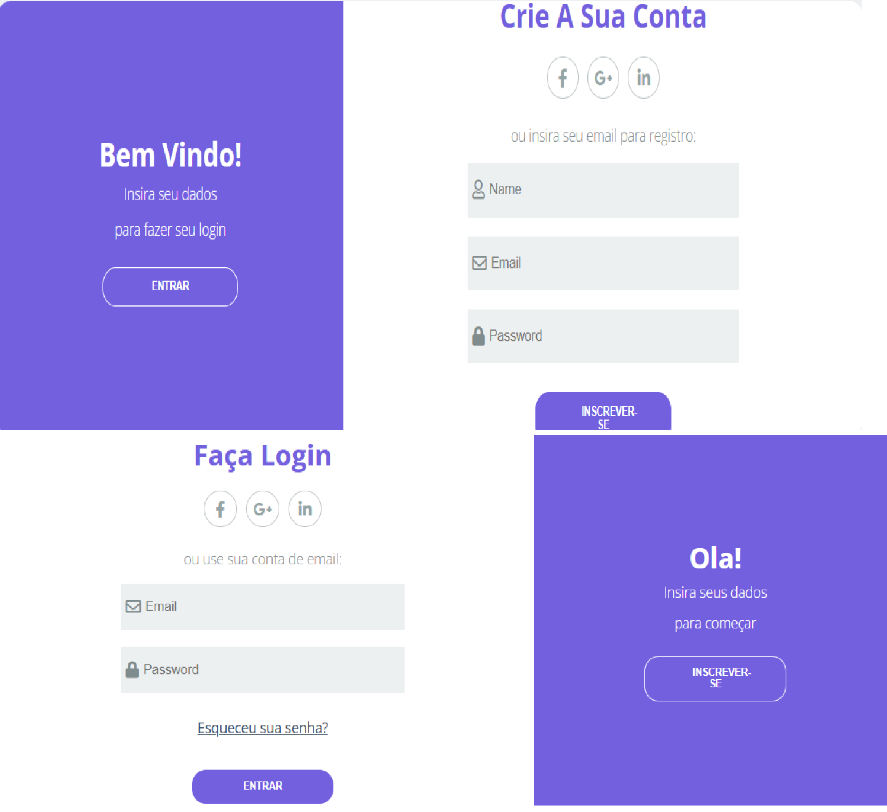

# Tela de Cadastro e Login

Representação de uma tela de cadastro com usuário e senha. E também, simultâneamente, uma tela de login. 

## 🔨 Funcionalidades do projeto

Este projeto tem como objetivo especializar as habilidades em javascript. Disponível para versões desktop, tablet e mobile.

## ✔️ Técnicas e tecnologias utilizadas

-`HTML`
-`CSS`
-`Javascript`
-`Acessibilidade Web`

## 🛠️ Abrir e rodar o projeto

Para abrir e rodar o projeto, utilize um editor de código de sua escolha.
Depois, abra o projeto no seu navegador.

## VERCEL 
https://tela-cadastro-chi.vercel.app/

